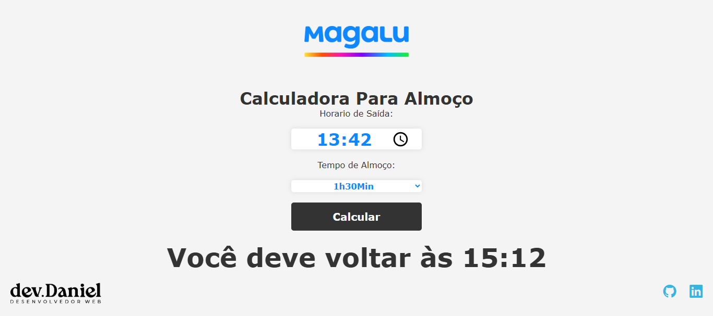

# 🥗 Calculadora de Almoço

## Preview do Projeto

## 📌 Descrição
Este é um projeto simples para calcular o horário de retorno do almoço. Basta informar o horário de saída e o tempo de almoço, e a ferramenta mostrará a que horas você deve voltar. 🚀  

## 🛠️ Tecnologias Utilizadas
- **HTML5**
- **CSS3**
- **JavaScript**

## 🎯 Funcionalidades
✅ Permite inserir o horário de saída para o almoço.  
✅ Possibilita selecionar a duração do almoço.  
✅ Calcula automaticamente o horário de retorno.  
✅ Interface simples, responsiva e fácil de usar.  

## 🚀 Como Utilizar
1. Abra o projeto no navegador.  
2. Insira o **horário de saída** no campo correspondente.  
3. Escolha o **tempo de almoço** no seletor.  
4. Clique no botão **"Calcular"** para ver a que horas precisa retornar.  

## 🌟 Melhorias Futuras
- Adicionar mais opções de tempo de almoço.  
- Autenticação com o Google e Meta (Facebook).  
- Salvar o horario anterios já consultados.  

## 🔗 Acesse o Projeto
🌐 [Testar a Calculadora de Almoço](https://calculadora-de-almoco.vercel.app/)  

📌 **Código-fonte no GitHub:**  
🔗 [Repositório no GitHub](https://github.com/danyeljorge/calculadora-de-almoco)  

## 👨‍💻 Autor  
Desenvolvido por [Daniel Jorge](https://github.com/danyeljorge).  

🚀 **Bora codar!**  

